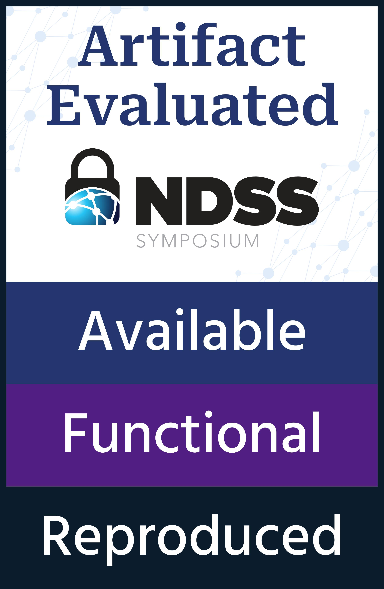

## Intro


We introduce **API Specification Propagation**, a concept where API specifications propagate through hierarchical API call chains. With this idea, we can use given seed specifications to perform propagation analysis and identify related predecessors or successors and generate specifications for them. 


To implement this, we design **APISpecGen**, a framework that generates new API specifications from seed specifications.
APISpecGen consists of two main modules:
- **Specification Generation**: Generates new specifications based on the initial seed specifications.
- **Bug Detection**: Uses the generated specifications to detect violations within the codebase, identifying potential bugs.

APISpecGen focuses on API Post-handing specifcations, where each specification is represented as a three-part tuple: `<target API, post-operation, critical variable>`, meaning that after invoking the target API, the post-operation should be applied to the critical variable.

For more details, you may refer to the paper "Uncovering iceberg from the tip: Generating API Specifications for Bug Detection via Specification Propagation Analysis" (NDSS 2025).

## Example workflow
The following figure illustrates a working example of APISpecGen. In this example, APISpecGen starts with the seed specification `<get_device, put_device, arg1>` and generates a new specification `<nfc_get_device, nfc_put_device, retval>`. This new specification is then applied to detect violations in the function `nfc_genl_vendor_cmd`.

<p align="center">

</p>

Specifically, the specification generation module generates new specifications, include details such as propagation paths. Here’s an example of a generated specification:
```shell
{
  "API": "nfc_get_device", // the inferred API
  "SecOp": "nfc_put_device",// the inferred post-operation for the API     
  "usageCount": 21, // the usage times that follows the specifcation in the programs
  "depth": 2, // the propogation depth 
  "API_path": "get_device->class_find_device->nfc_get_device", // The API's propogation chain 
  "var_path": "arg->retval->retval" // the critical variable's propogation chain 
}
```
For additional generated data, you may refer to `SpecGeneration/Data/ReferenceData`.

The bug detection module identifies potential bugs based on detected specification violations. Each bug report contains the buggy function and the violated specification. Here’s an example bug report:
```
repo_name,buggy_func,main_api,sec_op,var_type,var
kernel,nfc_genl_vendor_cmd,nfc_get_device,nfc_put_device,retval,dev
```
For more data, you may refer to `BugDetection/ReferenceData`


## Structure 

| Directory/File                       | Description                                                  |
| ------------------------------------ | ------------------------------------------------------------ |
| `SpecGeneration`                     | Specification Generation Module of APISpecGen                |
| ├─ `QuickMode`                       | Source code for specification generation                     |
| ├─ `utils`                           | Utility scripts used in the source code                      |
| └─ `Data`                            | Data for generated specifications                            |
| &nbsp;&nbsp;&nbsp;├──`ReferenceData` | Reference specifications generated by APISpecGen             |
| &nbsp;&nbsp;&nbsp;└─ `GeneratedSpec` | Specifications generated during runtime                      |
| `BugDetection`                       | Bug Detection Module of APISpecGen                           |
| ├─ `modules`                         | Source code for bug detection                                |
| ├─ `ReferenceData`                   | Data related to bugs and their corresponding specifications  |
| └─ `utils`                           | Utility scripts used in the source code                      |
| `APIAritifactEval`                   | Scripts and data for evaluating API artifact utilization     |
| `ComparedWithRelatedWork`            | Specification data from related work                         |
| `script`                             | Scripts for automating artifact evaluation                   |
| `config.cfg`                         | Configuration file with essential project settings and paths |
| `INSTALL.md`                         | Installation and setup instructions                          |
| `Doc_For_Aritifact_Evaluation.md`    | Step-by-step guide for artifact evaluation                   |


## Install

APISpecGen is implemented in Python and leverages existing code analysis tools, including [Joern](https://github.com/joernio/joern), [Tree-sitter](https://github.com/tree-sitter/tree-sitter), and [Weggli](https://github.com/weggli-rs/weggli).
We provide a [`Dockerfile`](./Dockerfile) to automate the setup and creation of the Docker environment. This Dockerfile includes everything needed to configure the runtime environment, install third-party tools and dependencies, set up Python libraries (as specified in requirements.txt), and download the source code for test programs (e.g., linux-5.16).

You can quickly build the Docker environment using the following command:
```shell
wget https://github.com/Yuuoniy/APISpecGen/raw/refs/heads/main/Dockerfile 
docker build -t apispecgen:latest .
docker run -it --name "apispecgen" "apispecgen:latest"
```

You may also refer to [INSTALL](./INSTALL.md)

## Step-by-Step Instructions
We provide step-by-step instruction for reproducing APISpecGen.
For more information about the evaluation process, please refer to [Doc_For_Aritifact_Evaluation](./Doc_For_Aritifact_Evaluation.md)

The key experiments are as follows:
| Experiemnt                               | Command                                | Description                                                                 | Results                                                                                                                              |
| ---------------------------------------- | -------------------------------------- | --------------------------------------------------------------------------- | ------------------------------------------------------------------------------------------------------------------------------------ |
| Minimal Running Example                  | -                                      | minimal running example for quick test.                                     | This will reproduced the working example displayed in the paper.                                                                     | - |
| ├─Quick Test for Specifcation Generation | ./script/0.quick_spec_generate.sh      | Perform specfication progation analysis for a seed with iteration set to 2. | The generated specification saved to `SpecGeneration/Data/GeneratedSpecs`                                                            |
| └─Quick Test for Bug Detection           | ./script/0.1.quick_bug_detection.sh    | Perform quick test for bug detection using one generated specification      | The script prints out the detected potential bugs.                                                                                   |
| Specifcation Generation                  | ./script/1.specification_generation.sh | Generate specifcations use the given six seed specifcations.                | The generated specification saved to  `SpecGeneration/Data/GeneratedSpec`.                                                           |
| Bug Detection                            | ./script/2.bug_detection.sh            | Use generated specifcations to detect new bugs in the Linux kernel.         | the bug reports will be continuously logged into the file `BugDetection/data/bug_report.csv`.                                        |
| Utilizebility of API Aritifacts          | ./script/3.API_aritifact_analysis.sh   | Use the generated specifications to evaluate the usability of API artifacts | This scripts print out the analysis data, which reveals that API artifacts have significant limitations in specification extraction. |


## Extension
You can extend APISpecGen to generate specifications for new seed APIs or new projects. 

For new seed APIs, you can either use tools like APHP to automatically extract seed specifications or manually create them in the tuple format `<target API, post-operation, critical variable>`.

To test on a new project, update the config.cfg file by adding the source code directories in the [URL] section. Use the following format:
```shell
[URL]
repo_name = {directory_of_repo_source_code}
#Example
openssl = ${Common:SOURCEDIR}/openssl
FFmpeg = ${Common:SOURCEDIR}/FFmpeg
```

Use the following command to generate specifications:
```shell
python SpecGeneration/spec_generate.py --seedAPI {TargetAPI} --seedSecOp {post-operation} --critical_var {critical-variable} --max_depth {max_iterations_for_analysis} --repo_name {repo_name}
#Examples:
python SpecGeneration/spec_generate.py --seedAPI av_malloc --seedSecOp av_free --critical_var retval --max_depth 5 --repo_name FFmpeg
python SpecGeneration/spec_generate.py --seedAPI BIO_new --seedSecOp BIO_free --critical_var retval --max_depth 5 --repo_name openssl
```
Our generated specifications are saved in the directory:
`SpecGeneration/Data/ReferenceData/OtherPrograms` for reference.

